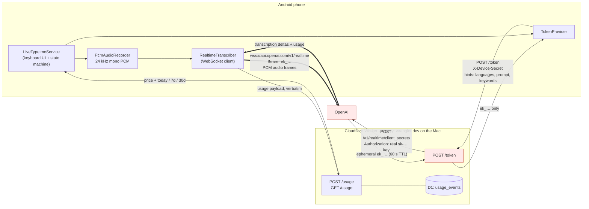

# LiveType — Architecture and Decisions

The durable record of *why* this project is shaped the way it is. `README.md`
tells a stranger how to run it; `AGENTS.md` is the working guide with local
setup and hard-won API gotchas. **This file is for decisions** — so a future
session does not re-litigate them or silently undo one.

Last updated: 2026-08-01.

---

## 1. Runtime topology

The thick arrows are the audio path. **Audio never transits the Worker** — the
phone talks to OpenAI directly.

### Where the code lives

| Concern | File |
|---|---|
| Keyboard UI, session state machine | `android/…/ime/LiveTypeImeService.kt` |
| Microphone capture, silencing detection | `android/…/audio/PcmAudioRecorder.kt` |
| WebSocket to OpenAI | `android/…/network/RealtimeTranscriber.kt` |
| Token fetch | `android/…/network/TokenProvider.kt` |
| Settings, build-time defaults | `android/…/config/AppSettings.kt` |
| Flags for built-but-disabled behaviour | `android/…/config/FeatureFlags.kt` |
| Hold-to-repeat (generic), word delete | `android/…/ime/HoldToRepeat.kt`, `WordDelete.kt` |
| Token minting, pricing, usage ledger | `worker/src/index.ts` |
| Usage schema | `worker/migrations/` |

---

## 2. Cloudflare is not currently in the loop

**`wrangler dev` runs the Worker runtime locally on the Mac.** No Cloudflare
account is involved, nothing is deployed, and D1 is emulated on disk under
`.wrangler/state`.

The consequence, which is easy to forget: **dictation only works while the
phone is tethered to the Mac over USB with the Worker running.** `adb reverse`
forwards `phone:8787 → mac:8787`.

Deploying (`wrangler deploy`) is what makes the keyboard usable away from the
desk. It is not done yet, and it is the user's call — see §5.

---

## 3. Architectural decisions

### 3.1 The phone connects to OpenAI directly; the Worker only mints tokens

The Worker holds the real `OPENAI_API_KEY` and exchanges it for a 60-second
ephemeral `ek_…` token. The phone never sees the real key.

Audio deliberately does not proxy through the Worker: it would add latency to a
latency-critical product, and long-lived audio streaming is a poor fit for
Workers' execution model. The cost is that a compromised phone can mint 60-second
transcription sessions — bounded, and revocable by rotating `DEVICE_SECRET`.

### 3.2 The Worker is the authority on model choice

`POST /token` builds the entire `client_secrets` request server-side. The device
body is parsed as **hints only** (`languages`, `prompt`, `keywords`); a `model`
field in it is ignored. Hints are clamped (8 languages, 100 keywords, 2000-char
prompt) and any hint the chosen model rejects is dropped, because OpenAI 400s
the whole request over one unsupported hint.

This means the model can be changed with the `TRANSCRIPTION_MODEL` var **without
rebuilding the app**, and a compromised device cannot select a costlier model.

Verified 2026-08-01 — one unsupported hint fails the whole request:

| Model | languages | prompt | keywords |
|---|---|---|---|
| `gpt-live-transcribe` *(default)* | yes | yes | yes |
| `gpt-transcribe` | yes | yes | yes |
| `gpt-4o-transcribe` | no | yes | no |
| `gpt-4o-mini-transcribe` | no | yes | no |
| `gpt-realtime-whisper` | no | no | no |
| `whisper-1` | no | yes | no |

### 3.3 Two OpenAI API traps, both cost real debugging time

**No `?model=` on the WebSocket URL.** A transcription session takes its model
from the ephemeral token. Passing a session model is rejected outright. Connect
to bare `wss://api.openai.com/v1/realtime`.

**`session.update` must not contain a `transcription` block.** OpenAI makes
`model` mandatory whenever that block is present, and a device-sent model
*overrides* the token's — which would hand model choice straight back to the
phone, defeating §3.2. The update exists only to re-assert the audio format and
to produce `session.updated`, which the app uses as its ready signal.

**Do not export non-function values from `worker/src/index.ts`.** workerd
inspects every named export of the entry module and refuses to boot on a bare
string export. Hence `defaultModel()` rather than an exported constant.

### 3.4 Connection is prewarmed, with a debounce, a grace period and a ceiling

The socket opens when the keyboard appears, not when the mic is tapped, so
dictation starts instantly. Naively this was expensive: every focus change in a
messenger tore the session down and built a new one — **27 token requests
measured in one Worker session**, each a real OpenAI session.

Now: prewarm is debounced (400 ms, trailing edge), teardown is deferred by an
8 s grace period so brief focus churn reuses the live socket, and a warm-but-idle
session is capped at 5 minutes. Measured after the fix: **6 open/close cycles →
0 new token requests, 6 reuses.**

`generation` is **not** bumped on reuse. It tracks the lifetime of a
`RealtimeTranscriber`; bumping it would orphan the callbacks of a socket that is
still live, leaving the app deaf to a session it is holding open.

### 3.5 The status line must never claim more than is true

`status_ready` is written in exactly one place — when the socket is actually
open. Before that the line says "not connected", then reports each connection
stage. Two indicators (token server, OpenAI) show red-with-`!` when down, a
spinner while connecting, green when up, and report their state on tap.

### 3.6 A silenced microphone is a state, not a failure

Since Android 10 only one client gets live microphone audio. When a screen
recorder or a call takes it, `AudioRecord` does not fail — it returns silence,
so the app would stream nothing while looking healthy.

`AudioRecordingCallback` + `isClientSilenced()` (API 29; guarded, minSdk is 28)
detect this. It is surfaced as a red status plus a warning icon and **must not
route through `failSession`** — the session stays up and recovers automatically
when the mic returns. Registration also seeds from
`activeRecordingConfigurations`, because registering does not replay current
state and a mic already taken before recording started would otherwise go
unreported.

This is honest handling of the platform policy, not a workaround. There is no
supported way for an ordinary app to win the microphone back.

### 3.7 Enter inserts a newline; it does not send

`commitText("\n")`, deliberately not `KEYCODE_ENTER` — in single-line fields the
key event fires the editor action and would send the message instead of breaking
the line.

Enter stays enabled *during* dictation. Because the transcript lives in a
composing region, pressing it freezes what has arrived (`finishComposingText`)
and records `committedChars`, so the final commit appends only the remainder
instead of duplicating the frozen text. `WordDelete` follows the same protocol.

### 3.8 Billing: the phone reports, the Worker prices

OpenAI already sends the billable quantity to the phone, inside
`conversation.item.input_audio_transcription.completed`:
`{"usage":{"type":"duration","seconds":3}}`. It is ceil'd per commit and charged
even when the transcript is empty.

The phone forwards that payload **verbatim**; the Worker owns the price table,
the model, and the aggregation, and stores rows in D1 keyed on `item_id` (free
idempotency), **freezing the price at session time** so a later price change
never rewrites history. Money is held in integer micro-USD, never floats.
Windows are whole *local* calendar days, so "today" means what the user thinks.

The Costs API was evaluated and rejected: it needs an admin key (403
`Missing scopes: api.usage.read`), buckets only by UTC day, and does not group
by model. An admin key also exposes ~119 endpoints including API-key minting —
strictly worse blast radius than the current key, which can only mint 60-second
tokens. The `source` field in the response leaves room to add it later as a
reconciliation row.

D1 rather than KV: KV's 1 write/sec/key limit and read-modify-write races make
it unfit for a counter.

### 3.9 Debug and release builds differ on purpose

| | debug | release |
|---|---|---|
| `BuildConfig.DEFAULT_TOKEN_ENDPOINT` | `http://127.0.0.1:8787/token` | `""` |
| `BuildConfig.DEFAULT_DEVICE_SECRET` | read from `worker/.dev.vars` | `""` |
| `BuildConfig.DEFAULT_KEYWORDS` | read from `data/keywords.txt` | `""` |
| Cleartext HTTP | loopback only (`src/debug` network config) | forbidden |
| `isAllowedTokenEndpoint()` | `https://` or `http://` | `https://` only |

Baked values are `SharedPreferences` **defaults only** — a saved value always
wins. A missing `worker/.dev.vars` or `data/keywords.txt` is not a build error
(fresh clones, CI); release behaviour is the fallback in that case.

**The debug APK therefore contains `DEVICE_SECRET` and the keyword list in
plaintext and must never be distributed.** `*.apk` is gitignored for this
reason. Verified by grepping the dex of both APKs, with the debug APK as the
positive control.

### 3.9.1 The keyword list is version-controlled, encrypted

Custom vocabulary (transcription hints) used to exist only as text typed into
the app's settings on one phone — unbacked-up and unreviewable. It now lives in
`data/keywords.txt`: one term per line, `#` comments, hand-maintained in an
editor.

The repo is intended to go public, and a personal vocabulary list is not
something to publish. So the plaintext is **gitignored** and only
`data/keywords.txt.age` — encrypted with `age` to the user's public key — is
committed. Encryption needs the public recipient only, so any session or CI job
can re-encrypt; only the user can decrypt. `scripts/keywords-{en,de}crypt.sh`
wrap both directions so the invocation never has to be remembered.

Rejected alternatives: committing the list in the clear (the point was to not
publish it); `git-crypt`/SOPS (heavier, and the user already keeps an age
identity for chezmoi); an encrypted blob read at runtime by the app (the phone
would need the private key).

The Gradle side reads it via `providers.fileContents()` rather than
`File.readText()`, so the file is a tracked configuration input and a changed
list cannot survive as a stale cached value.

### 3.10 Feature flags instead of deleting or commenting out

`FeatureFlags.RETURN_TO_PREVIOUS_KEYBOARD = false` — auto-switching back to the
previous keyboard after dictation is implemented but off; it fought the user,
who usually wants to keep dictating. The flag wins over the stored preference,
and the settings checkbox hides while it is off so the UI never offers a toggle
that does nothing.

### 3.11 Localisation

`values/` is English and is the fallback for every locale except Russian;
`values-ru/` is Russian. Strings that are never localised (product and brand
names, format strings, URLs, env-var names) are marked `translatable="false"`
rather than duplicated — `lintVitalRelease` runs inside `assembleRelease`, so an
untranslated key blocks the release build entirely.

**No user-facing literal belongs in Kotlin.**

---

## 4. Decisions the user made explicitly

| Decision | Rationale |
|---|---|
| **Stay on `gpt-live-transcribe` despite ~4x cost** | Measured: it streams the first delta at t≈1.2 s while speaking. `gpt-transcribe` ($0.0045/min vs $0.017/min) emits nothing until after commit — text only appears when you press finish. Real-time feedback is the point of the product; the extra ~$4/month is accepted. |
| **Debug APK carrying the secret is acceptable** | It is a personal phone and an adb install. Convenience beats secrecy here, given the APK is never distributed. |
| **All billing logic on the backend** | The phone renders numbers, never computes them. |
| **Billing surfaces price/minute + today / 7d / 30d** | |
| **No dark theme** | Keyboard background `#E0EAEC`; the system nav glyphs are made dark via `APPEARANCE_LIGHT_NAVIGATION_BARS` rather than by darkening the keyboard. |
| **Recognised text is not mirrored in the keyboard** | It goes straight into the editor; the keyboard only shows status. |
| **Two big square thumb buttons became a 2x2 grid** | Right-edge placement for right-thumb reach: keyboard/mic on top, backspace/Enter below. |

### Working agreement

Rebuild and reinstall after **each** individual change, as a background command
— and after **every merge**. A green `assembleDebug` only proves it compiles;
parallel agents can each build cleanly and combine into something broken.
Screenshot the result for any UI change. See `AGENTS.md` for the commands.

---

## 5. Open questions

1. **Deploy the Worker to Cloudflare?** Until then the keyboard only works
   tethered to the Mac. Requires `wrangler deploy` plus a remote D1
   (`wrangler d1 create livetype-usage`) for billing history to follow the phone.
2. **Publish the repo?** It is prepared (README, MIT licence, CI, secret scan
   clean) and committed locally, but never pushed — publishing is the user's
   call.
3. **Release signing.** `assembleRelease` currently produces an *unsigned* APK.
   Attaching builds to GitHub Releases needs a signing config fed from secrets,
   with the keystore kept out of the repo.
4. **FUTO mic hand-off.** Investigated: FUTO's mic button switches to the first
   *enabled* IME declaring an `imeSubtypeMode="voice"` subtype — it does not use
   `RecognizerIntent`. LiveType declares no subtype, so it is invisible to that
   mechanism. Adding one (~5 lines, plus `overridesImplicitlyEnabledSubtype="true"`,
   which is required, not cosmetic) plus FUTO's "Disable built-in voice input"
   toggle would wire it up with no fork. Confirmed on-device that the voice slot
   is free: only `org.futo.voiceinput` declares one and it is not enabled.
   Not implemented.
5. **Worker rate limiting** is recommended in the README but not configured.
