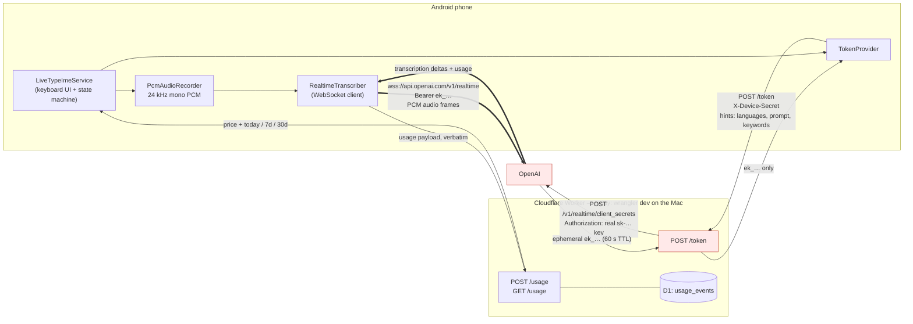

# LiveType — Architecture and Decisions

The durable record of *why* this project is shaped the way it is. `README.md`
tells a stranger how to run it; `AGENTS.md` is the working guide with local
setup and hard-won API gotchas. **This file is for decisions** — so a future
session does not re-litigate them or silently undo one.

Last updated: 2026-08-01.

---

## 1. Runtime topology



The thick arrows are the audio path. **Audio never transits the Worker** — the
phone talks to OpenAI directly.

### Where the code lives

| Concern | File |
|---|---|
| Keyboard UI, session state machine | `android/…/ime/LiveTypeImeService.kt` |
| Microphone capture, silencing detection | `android/…/audio/PcmAudioRecorder.kt` |
| WebSocket to OpenAI | `android/…/network/RealtimeTranscriber.kt` |
| Token fetch | `android/…/network/TokenProvider.kt` |
| Settings, build-time defaults | `android/…/config/AppSettings.kt` |
| Flags for built-but-disabled behaviour | `android/…/config/FeatureFlags.kt` |
| Hold-to-repeat (generic), word delete | `android/…/ime/HoldToRepeat.kt`, `WordDelete.kt` |
| Token minting, pricing, usage ledger | `worker/src/index.ts` |
| Usage schema | `worker/migrations/` |

---

## 2. Cloudflare is half in the loop: the database exists, the Worker does not

**The remote D1 database is real.** `livetype-usage`,
`850f00b2-d22f-49ff-bcdb-f0eca6f087da`, region WEUR, created in the
`cf@dobrinskiy.me` account on 2026-08-01 with `0001_usage_events.sql` applied
`--remote`. `worker/wrangler.jsonc` now carries that id instead of the old
`REPLACE_WITH_ID_FROM_WRANGLER_D1_CREATE` placeholder, so a deploy would bind
to something real. It starts empty, by design — see §3.8.

**The Worker itself is still not deployed.** Two account-level gates stopped
`wrangler deploy` on 2026-08-01, both needing the account owner rather than a
code change:

1. **The Cloudflare account's email address is unverified.** Any write to
   `/workers/scripts/*` returns `10034 — You need to verify your email address
   to use Workers`. This blocks `wrangler secret put` and `wrangler deploy`
   alike. (D1 is not gated on it, which is why step 1 succeeded.)
2. **No `workers.dev` subdomain has ever been registered** (`10007`). One is
   created by opening the Workers & Pages page in the dashboard once, or by
   answering wrangler's interactive prompt — it names a permanent,
   account-wide hostname, so it is not a choice to make on the owner's behalf.

Until both are cleared, **`wrangler dev` on the Mac remains the only path** and
**dictation only works while the phone is tethered over USB with the Worker
running** — `adb reverse` forwards `phone:8787 → mac:8787`. That local path is
not going away when the deploy lands: it stays the development loop, with its
own separate local D1 under `.wrangler/state`.

Deploying is what makes the keyboard usable away from the desk. See §5.

**When it does deploy, it will be a public URL with no rate limiting** — one
static `DEVICE_SECRET` is the only guard, and that secret has already leaked
once, in a screen recording. See §5.5.

---

## 3. Architectural decisions

### 3.1 The phone connects to OpenAI directly; the Worker only mints tokens

The Worker holds the real `OPENAI_API_KEY` and exchanges it for a 60-second
ephemeral `ek_…` token. The phone never sees the real key.

Audio deliberately does not proxy through the Worker: it would add latency to a
latency-critical product, and long-lived audio streaming is a poor fit for
Workers' execution model. The cost is that a compromised phone can mint 60-second
transcription sessions — bounded, and revocable by rotating `DEVICE_SECRET`.

### 3.2 The Worker is the authority on model choice

`POST /token` builds the entire `client_secrets` request server-side. The device
body is parsed as **hints only** (`languages`, `prompt`, `keywords`); a `model`
field in it is ignored. Hints are clamped (8 languages, 100 keywords, 2000-char
prompt) and any hint the chosen model rejects is dropped, because OpenAI 400s
the whole request over one unsupported hint.

This means the model can be changed with the `TRANSCRIPTION_MODEL` var **without
rebuilding the app**, and a compromised device cannot select a costlier model.

Verified 2026-08-01 — one unsupported hint fails the whole request:

| Model | languages | prompt | keywords |
|---|---|---|---|
| `gpt-live-transcribe` *(default)* | yes | yes | yes |
| `gpt-transcribe` | yes | yes | yes |
| `gpt-4o-transcribe` | no | yes | no |
| `gpt-4o-mini-transcribe` | no | yes | no |
| `gpt-realtime-whisper` | no | no | no |
| `whisper-1` | no | yes | no |

### 3.3 Two OpenAI API traps, both cost real debugging time

**No `?model=` on the WebSocket URL.** A transcription session takes its model
from the ephemeral token. Passing a session model is rejected outright. Connect
to bare `wss://api.openai.com/v1/realtime`.

**`session.update` must not contain a `transcription` block.** OpenAI makes
`model` mandatory whenever that block is present, and a device-sent model
*overrides* the token's — which would hand model choice straight back to the
phone, defeating §3.2. The update exists only to re-assert the audio format and
to produce `session.updated`, which the app uses as its ready signal.

**Do not export non-function values from `worker/src/index.ts`.** workerd
inspects every named export of the entry module and refuses to boot on a bare
string export. Hence `defaultModel()` rather than an exported constant.

### 3.4 Connection is prewarmed, with a debounce, a grace period and a ceiling

The socket opens when the keyboard appears, not when the mic is tapped, so
dictation starts instantly. Naively this was expensive: every focus change in a
messenger tore the session down and built a new one — **27 token requests
measured in one Worker session**, each a real OpenAI session.

Now: prewarm is debounced (400 ms, trailing edge), teardown is deferred by an
8 s grace period so brief focus churn reuses the live socket, and a warm-but-idle
session is capped at 5 minutes. Measured after the fix: **6 open/close cycles →
0 new token requests, 6 reuses.**

**A completed phrase does not close the socket.** One transcription session
handles many phrases: after
`conversation.item.input_audio_transcription.completed`, sending more audio and
another `input_audio_buffer.commit` on the *same* socket works. Verified against
the live API on 2026-08-01 — three phrases through one session, each with its
own `item_id` and its own `usage` of 3 s, so per-phrase billing stays exact.
`completeSession` therefore commits the text, clears the per-phrase state
(`partialTranscript` and `committedChars`, which must go together — one is an
offset into the other) and lands back in `READY` with the indicators still
green. Tapping stop no longer costs a worker round-trip, a fresh OpenAI session
and a visible reconnect for nothing.

The 5-minute ceiling is consequently measured from **last activity, not from
when the socket opened**: `beginRecording` drops it and `completeSession`
re-arms it. Armed once at `openSession` it would have killed an actively used
session mid-conversation.

**Switching to another keyboard closes the session immediately — deliberately.**
Focus moving inside an app is accidental (a different field, the keyboard
hidden and shown), so it earns the grace period. Choosing a different IME is an
explicit "I am done dictating", and the next dictation could be an hour away.
Holding the socket past that point would keep pinging every 20 s, keeping the
radio out of deep sleep, for a session nobody will use — and OpenAI's own
session limit would eventually close it anyway, surfacing as a spurious
"connection closed". This is why `cancelDictation("keyboard-switched")` does
not go through the grace timer. Do not "fix" it.

`generation` is **not** bumped on reuse — and a completed phrase is a reuse. It
tracks the lifetime of a `RealtimeTranscriber`; bumping it while the transcriber
survives would orphan the callbacks of a socket that is still live, leaving the
app deaf to a session it is holding open, including the `onClosed` that would
tell it the session had died. Only the paths that actually destroy the
transcriber bump it: `cancelDictation`, `failSession`, and the idle/grace
teardowns that go through them.

**Cancel abandons the phrase, not the session.** It used to be the same
teardown as everything else, so tapping it turned both indicators red and made
the next dictation reconnect from scratch. `abandonPhrase` is now the mirror of
`completeSession`: stop the recorder, send `input_audio_buffer.clear`, drop
`partialTranscript` and `committedChars`, re-arm the idle ceiling, land in
`READY` with the socket up. It therefore **must not** bump `generation` — by
the rule above, that would deafen a socket it is keeping — so the in-flight
phrase is silenced by three narrower guards instead: the cleared buffer means
uncommitted audio is never transcribed and never billed; deltas are matched
against the abandoned `item_id` and ignored outside RECORDING / FINISHING; and
a Cancel pressed in FINISHING, where the commit had already gone out, counts
one `abandonedCompletions` so that transcript is dropped on arrival (its usage
is still reported — OpenAI charged for it). With no live transcriber, or with
no phrase in flight, Cancel falls back to the full `cancelDictation` teardown.
Every other caller of `cancelDictation` is unchanged.

### 3.5 The status line must never claim more than is true

`status_ready` is written in exactly one place — when the socket is actually
open. Before that the line says "not connected", then reports each connection
stage. Two indicators (token server, OpenAI) show red-with-`!` when down, a
spinner while connecting, green when up, and report their state on tap.

### 3.6 A silenced microphone is a state, not a failure

Since Android 10 only one client gets live microphone audio. When a screen
recorder or a call takes it, `AudioRecord` does not fail — it returns silence,
so the app would stream nothing while looking healthy.

`AudioRecordingCallback` + `isClientSilenced()` (API 29; guarded, minSdk is 28)
detect this. It is surfaced as a red status, a warning icon and a red record
button — all three driven by `setState`'s generic `warning` flag, which writes
the ordinary appearance back unconditionally, so recovery cannot depend on some
specific path remembering to undo the red. It **must not route through
`failSession`** — the session stays up and recovers automatically
when the mic returns. Registration also seeds from
`activeRecordingConfigurations`, because registering does not replay current
state and a mic already taken before recording started would otherwise go
unreported.

This is honest handling of the platform policy, not a workaround. There is no
supported way for an ordinary app to win the microphone back.

### 3.7 Enter inserts a newline; it does not send

`commitText("\n")`, deliberately not `KEYCODE_ENTER` — in single-line fields the
key event fires the editor action and would send the message instead of breaking
the line.

Enter stays enabled *during* dictation. Because the transcript lives in a
composing region, pressing it freezes what has arrived (`finishComposingText`)
and records `committedChars`, so the final commit appends only the remainder
instead of duplicating the frozen text. `WordDelete` follows the same protocol.

### 3.8 Billing: the phone reports, the Worker prices

OpenAI already sends the billable quantity to the phone, inside
`conversation.item.input_audio_transcription.completed`:
`{"usage":{"type":"duration","seconds":3}}`. It is ceil'd per commit and charged
even when the transcript is empty.

The phone forwards that payload **verbatim**; the Worker owns the price table,
the model, and the aggregation, and stores rows in D1 keyed on `item_id` (free
idempotency), **freezing the price at session time** so a later price change
never rewrites history. Money is held in integer micro-USD, never floats.
Windows are whole *local* calendar days, so "today" means what the user thinks.

The Costs API was evaluated and rejected: it needs an admin key (403
`Missing scopes: api.usage.read`), buckets only by UTC day, and does not group
by model. An admin key also exposes ~119 endpoints including API-key minting —
strictly worse blast radius than the current key, which can only mint 60-second
tokens. The `source` field in the response leaves room to add it later as a
reconciliation row.

D1 rather than KV: KV's 1 write/sec/key limit and read-modify-write races make
it unfit for a counter.

Cost is stored in **nano**-USD, not micro. One second of `gpt-live-transcribe`
is 283 333 nanos; rounding that to whole micro-dollars would lose about 20% on
short phrases. Every row also freezes the unit price in force at the time of
the session, so a later price change never re-prices history.

#### Where the usage data actually lives

`wrangler dev` does **not** talk to Cloudflare. It emulates D1 as a local
SQLite file:

```
worker/.wrangler/state/v3/d1/miniflare-D1DatabaseObject/<hash>.sqlite
```

`.wrangler/` is gitignored, so usage never enters the repository. Two
consequences that are easy to get wrong:

**The local and the deployed databases are unrelated.** Deploying does not
migrate local rows anywhere; spend accumulated during local development stays
on that machine and the cloud database starts empty. Moving it across takes a
deliberate export/import. Equally, deleting `.wrangler/` — a `git clean -x`, a
tidy-up — destroys the local history silently.

**Ordinary updates do not touch the data.** `wrangler deploy` publishes worker
code only; the database is a separate resource it never recreates. Migrations
are guarded twice over: wrangler records which ones have run and skips them,
and `0001_usage_events.sql` is written idempotently (`CREATE TABLE IF NOT
EXISTS`, `CREATE INDEX IF NOT EXISTS`), so re-applying it is harmless even if
that bookkeeping is lost.

Data can only be lost through a deliberate act: running `wrangler d1 execute`
with destructive SQL, deleting and recreating the database, or adding a
migration containing `DROP`/`ALTER`. Keep new migrations additive.

### 3.9 Debug and release builds differ on purpose

| | debug | release |
|---|---|---|
| `BuildConfig.DEFAULT_TOKEN_ENDPOINT` | `http://127.0.0.1:8787/token` | `""` |
| `BuildConfig.DEFAULT_DEVICE_SECRET` | read from `worker/.dev.vars` | `""` |
| `BuildConfig.DEFAULT_KEYWORDS` | read from `data/keywords.txt` | `""` |
| Cleartext HTTP | loopback only (`src/debug` network config) | forbidden |
| `isAllowedTokenEndpoint()` | `https://` or `http://` | `https://` only |

Baked values are `SharedPreferences` **defaults only** — a saved value always
wins. A missing `worker/.dev.vars` or `data/keywords.txt` is not a build error
(fresh clones, CI); release behaviour is the fallback in that case.

**The debug APK therefore contains `DEVICE_SECRET` and the keyword list in
plaintext and must never be distributed.** `*.apk` is gitignored for this
reason. Verified by grepping the dex of both APKs, with the debug APK as the
positive control.

### 3.9.1 The keyword list is version-controlled, encrypted

Custom vocabulary (transcription hints) used to exist only as text typed into
the app's settings on one phone — unbacked-up and unreviewable. It now lives in
`data/keywords.txt`: one term per line, `#` comments, hand-maintained in an
editor.

The repo is intended to go public, and a personal vocabulary list is not
something to publish. So the plaintext is **gitignored** and only
`data/keywords.txt.age` — encrypted with `age` to the user's public key — is
committed. Encryption needs the public recipient only, so any session or CI job
can re-encrypt; only the user can decrypt. `scripts/keywords-{en,de}crypt.sh`
wrap both directions so the invocation never has to be remembered.

Rejected alternatives: committing the list in the clear (the point was to not
publish it); `git-crypt`/SOPS (heavier, and the user already keeps an age
identity for chezmoi); an encrypted blob read at runtime by the app (the phone
would need the private key).

The Gradle side reads it via `providers.fileContents()` rather than
`File.readText()`, so the file is a tracked configuration input and a changed
list cannot survive as a stale cached value.

### 3.10 Feature flags instead of deleting or commenting out

`FeatureFlags.RETURN_TO_PREVIOUS_KEYBOARD = false` — auto-switching back to the
previous keyboard after dictation is implemented but off; it fought the user,
who usually wants to keep dictating. The flag wins over the stored preference,
and the settings checkbox hides while it is off so the UI never offers a toggle
that does nothing.

### 3.11 Localisation

`values/` is English and is the fallback for every locale except Russian;
`values-ru/` is Russian. Strings that are never localised (product and brand
names, format strings, URLs, env-var names) are marked `translatable="false"`
rather than duplicated — `lintVitalRelease` runs inside `assembleRelease`, so an
untranslated key blocks the release build entirely.

**No user-facing literal belongs in Kotlin.**

### 3.12 The Paste buffer is memory-only and expires in five minutes

Dictating while no editor has focus used to lose the transcript outright:
`currentInputConnection` is null or has no target, `commitText` silently does
nothing, and the user has to say it all again. `RecentPhrase` keeps the last
recognised phrase so the Paste thumb button can put it somewhere afterwards.

**It is a single string in a field — never `SharedPreferences`, never a file,
never a database, and deliberately not the system clipboard.** `README.md`
promises "LiveType keeps no dictation history", and the clipboard is globally
readable and mirrored into the clipboard-history UI, so using it as a fallback
would be a materially different privacy posture. That option is left open for
the user to decide, not taken unilaterally.

Expiry drops the **reference** on a `postDelayed` callback rather than gating a
retained string behind a timestamp check, so after five minutes the transcript
is genuinely unreachable. The timer is removed by `remember`, `clear` and
`release`, and `onDestroy` calls `release()` explicitly before the blanket
`removeCallbacksAndMessages(null)`.

Pasting follows the composing-region protocol of §3.7 — `finishComposingText()`
then `committedChars` while RECORDING / CONNECTING / FINISHING — and does not
consume the phrase, because the first target may have been the wrong field.

Fitting a third square into the thumb row cost the grid its 88dp: three of them
plus gaps is 280dp, which leaves the status column 93dp on a 411dp screen. At
72dp the widest row is 232dp and the left column keeps 141dp. The full
arithmetic is in the `THUMB_BUTTON_DP` KDoc.

### 3.13 A recording has a ceiling too, and it ends the phrase normally

The failure mode is real and was hit in use: dictate, the text lands, send the
message — and forget to tap stop. The keyboard then records indefinitely and
OpenAI bills every committed second of it. §3.4's ceilings do not help; they
guard an *idle* socket, and this one is busy.

So `recordingCeilingRunnable` caps the recording itself, configurable from the
settings screen at 1–20 minutes, **default 3**. Unlike the endpoint dropdown
(§3.9) it is in release builds too: anyone can forget to tap stop.

**It is a completion, not a cancellation.** Expiry routes through
`finishDictation()` — the same method the stop square calls — so the buffer is
committed, the transcript comes back through `onTranscriptCompleted`, the text
is inserted, the usage is reported exactly once and the socket stays warm in
`READY`. Nothing the user said is lost, and there is no second copy of the stop
logic to drift. The only difference from a tap is the status line:
`status_stopped_time_limit` names the limit that was reached, so an
unexpectedly ended recording is not mysterious. It is deliberately not styled
as an error — nothing failed.

**The two ceilings never fight.** They cover disjoint halves of a session's
life and hand over in one pair of lines each way: `beginRecording` drops
`warmCeilingRunnable` and arms `recordingCeilingRunnable`, `completeSession`
does the reverse. At most one is pending at any moment, so the idle ceiling
cannot cut a recording short and the recording ceiling cannot close a socket
the user is merely looking at.

The limit is read at `beginRecording`, not at `openSession`, so a change in
settings applies to the next phrase rather than the next reconnect; the value
is captured into a field so the status line quotes the limit that actually
applied. Cancellation follows the file's established rule — a named `Runnable`
and an explicit `removeCallbacks` on **every** route out of `RECORDING`:
`finishDictation`, `completeSession` (OpenAI can end a turn on its own),
`abandonPhrase` (the Cancel button, which re-arms the idle ceiling in its
place), `cancelDictation` (keyboard switch, password field, grace and idle
teardown, `onDestroy`) and `failSession`.

---

## 4. Decisions the user made explicitly

| Decision | Rationale |
|---|---|
| **Stay on `gpt-live-transcribe` despite ~4x cost** | Measured: it streams the first delta at t≈1.2 s while speaking. `gpt-transcribe` ($0.0045/min vs $0.017/min) emits nothing until after commit — text only appears when you press finish. Real-time feedback is the point of the product; the extra ~$4/month is accepted. |
| **Debug APK carrying the secret is acceptable** | It is a personal phone and an adb install. Convenience beats secrecy here, given the APK is never distributed. |
| **All billing logic on the backend** | The phone renders numbers, never computes them. |
| **Billing surfaces price/minute + today / 7d / 30d** | |
| **No dark theme** | Keyboard background `#E0EAEC`; the system nav glyphs are made dark via `APPEARANCE_LIGHT_NAVIGATION_BARS` rather than by darkening the keyboard. |
| **Recognised text is not mirrored in the keyboard** | It goes straight into the editor; the keyboard only shows status. |
| **Two big square thumb buttons became a 2x2 grid** | Right-edge placement for right-thumb reach: keyboard/mic on top, backspace/Enter below. |

### Working agreement

Rebuild and reinstall after **each** individual change, as a background command
— and after **every merge**. A green `assembleDebug` only proves it compiles;
parallel agents can each build cleanly and combine into something broken.
Screenshot the result for any UI change. See `AGENTS.md` for the commands.

---

## 5. Open questions

1. **Deploy the Worker to Cloudflare.** Decided yes; **blocked on the account,
   not on the code** — see §2. The remote D1 half is done. What remains needs
   the account owner: verify the Cloudflare account's email address, and let a
   `workers.dev` subdomain be created. After that, `wrangler secret put
   OPENAI_API_KEY`, `wrangler secret put DEVICE_SECRET`, `wrangler deploy`.
   Until then the keyboard only works tethered to the Mac.
2. **Publish the repo?** Done — public at `github.com/ddobrinskiy/LiveType`.
   Which raises the stakes on item 5: anything committed here is world-readable,
   and the README's rate-limiting recommendation is now advice given in public
   about an endpoint that does not follow it.
3. **Release signing.** `assembleRelease` currently produces an *unsigned* APK.
   Attaching builds to GitHub Releases needs a signing config fed from secrets,
   with the keystore kept out of the repo.
4. **FUTO mic hand-off.** Investigated: FUTO's mic button switches to the first
   *enabled* IME declaring an `imeSubtypeMode="voice"` subtype — it does not use
   `RecognizerIntent`. LiveType declares no subtype, so it is invisible to that
   mechanism. Adding one (~5 lines, plus `overridesImplicitlyEnabledSubtype="true"`,
   which is required, not cosmetic) plus FUTO's "Disable built-in voice input"
   toggle would wire it up with no fork. Confirmed on-device that the voice slot
   is free: only `org.futo.voiceinput` declares one and it is not enabled.
   Not implemented.
5. **Worker rate limiting** is recommended in the README but not configured, and
   the decision was explicitly to deploy without it. The moment item 1 clears,
   the token endpoint is a public URL whose only guard is a static
   `DEVICE_SECRET` — one that has already leaked once, in a screen recording. A
   holder of it can mint 60-second transcription sessions against the account's
   OpenAI key, without limit, and the ledger in §3.8 would record the spend but
   not stop it. Rotating the secret is the mitigation that exists today.
